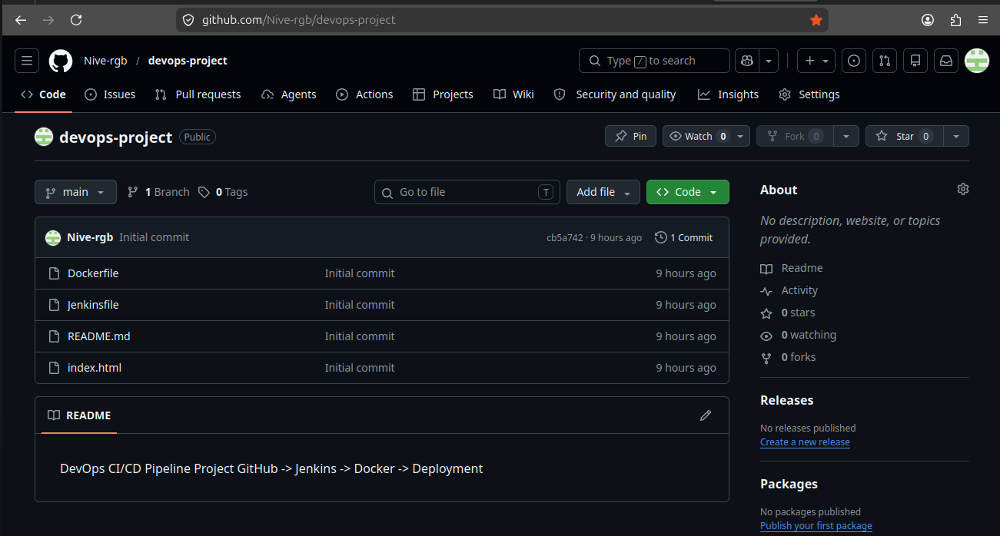
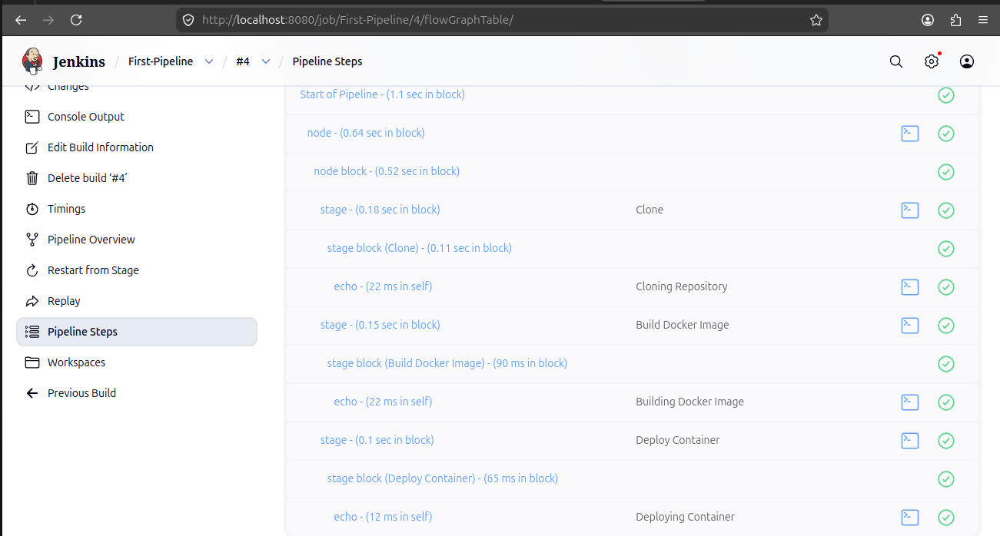
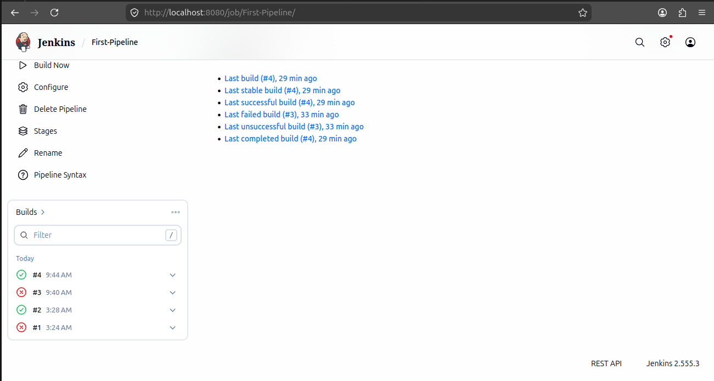
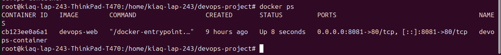
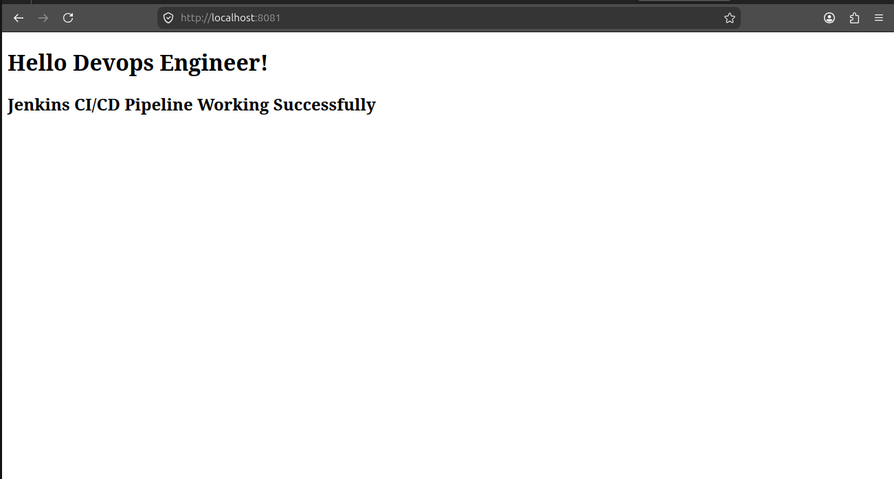

# DevOps CI/CD Pipeline Project

This project demonstrates a CI/CD pipeline using GitHub, Jenkins, and Docker.

## Tools Used

- GitHub
- Jenkins
- Docker

## Project Files

- Dockerfile
- Jenkinsfile
- index.html

## Screenshots

### GitHub Repository

### Jenkins Dashboard

### Pipeline Steps

### Docker Running

### Browser Output

## Result

Jenkins CI/CD Pipeline Working Successfully.
